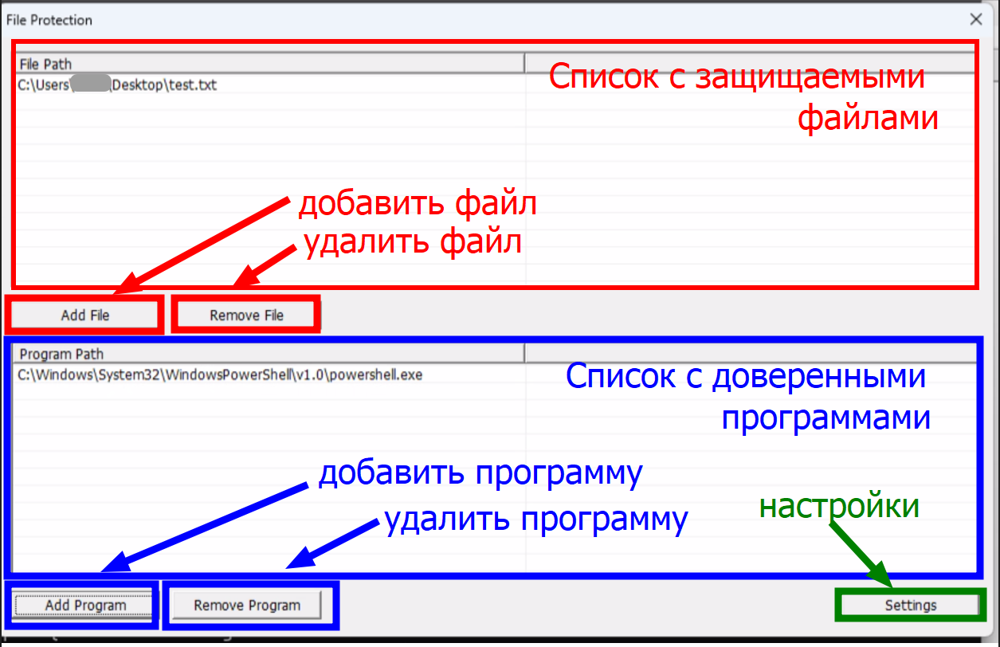
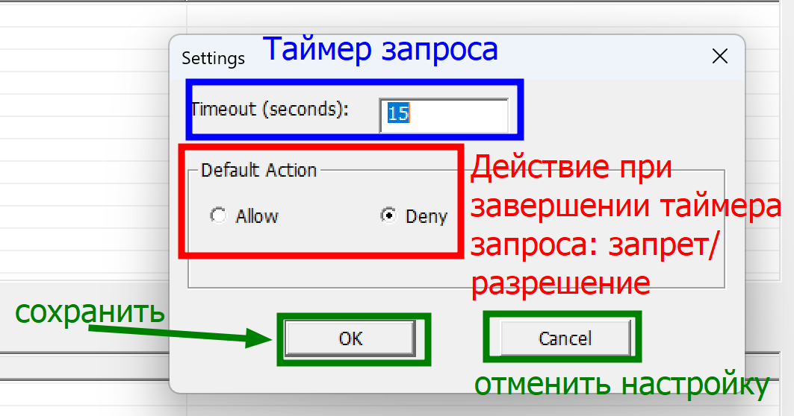
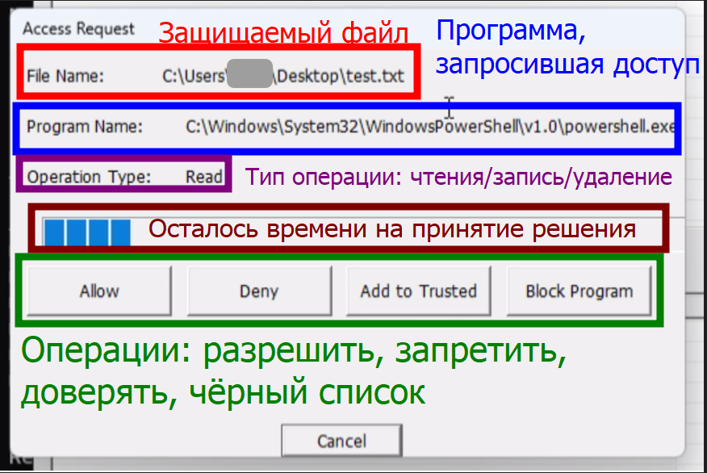

# FileController
[](https://github.com/PD758/FileController/actions/workflows/main.yml)


## Описание
**FileController** — это решение для контроля доступа к файлам с использованием драйвера-фильтра файловой системы Windows.
Решение состоит из двух частей:
- **FileController.exe** — графическое приложение для управления доступом к файлам.
- **FileControllerDriver** — драйвер-фильтр файловой системы (KMDF Minifilter).

## Установка из релиза

- Перед установкой отключите Secure Boot в BIOS/UEFI и выполните команду `bcdedit /set testsigning on`. Это необходимо для установки драйвера, подписанного тестовой подписью.
- Скачайте графическое приложение и драйвер из одного из доступных релизов: <br>
 [](https://github.com/PD758/FileController/releases/tag/stable) <br>
[](https://github.com/PD758/FileController/releases/tag/latest) 
- Разархивируйте FileControllerDriver.zip
- Установите драйвер, нажав ПКМ на *FileControllerDriver.inf* и выбрав "установить", либо можете использовать команду `pnputil /add-driver FileControllerDriver.inf /install`
- Для запуска драйвера выполните команду `sc start FileControllerDriver` из командной строки с правами администратора, либо перезапустите компьютер
- Для запуска графического интерфейса запустите файл *FileController.exe* от имени администратора

## Сборка из исходных файлов

### Требования
- Visual Studio 2022 или Visual Studio Build Tools
- Windows SDK и Windows Driver Kit (WDK)
- Windows 10/11 (x64)

Установить WinSDK и WDK можно с помощью Chocolatey (если есть):
```sh
choco install windows-sdk-10-version-1903-all windowsdriverkit10 -y
```

### Компиляция
Собрать проект можно с помощью MSBuild, либо с помощью интерфейса Visual Studio:
```sh
msbuild FileController.sln /p:Configuration=Release /p:Platform=x64
```
После успешной компиляции необходимые файлы будут находиться в папке `x64/Release`:
- `FileController.exe` — графическое приложение.
- `x64/Release/FileControllerDriver/FileControllerDriver.inf` — INF-файл для установки драйвера.
- `x64/Release/FileControllerDriver/FileControllerDriver.cat` — файл подписи драйвера.
- `x64/Release/FileControllerDriver/FileControllerDriver.sys` — исполняемый файл драйвера.

### Установка драйвера
1. Разрешить тестовые подписи и отключить Secure Boot:
   ```sh
   bcdedit /set testsigning on
   ```
   После выполнения перезагрузите компьютер.

2. Установить драйвер:
   - Перейдите в папку `x64/Release/FileControllerDriver`.
   - Нажмите ПКМ на `FileControllerDriver.inf` и выберите **"Установить"**. Также можно использовать команду `pnputil /add-driver FileControllerDriver.inf /install`.
   - Подтвердите установку неподписанного драйвера.
   - Дождитесь сообщения об успешной установке.

3. Запустить драйвер:
   ```sh
   sc start FileControllerDriver
   ```
   **Важно!** Запускать команду необходимо в **командной строке (cmd)** с правами администратора (PowerShell не подойдет). Также можно перезагрузить компьютер, тогда драйвер также запустится при запуске.

4. Запуск графического интерфейса:
   - Перейдите в папку `x64/Release`.
   - Запустите `FileController.exe`.

# Графический интерфейс



В главном окне решения можно добавить и удалить файл в списке защиты и управлять списком доверенных программ.

Также можно открыть окно настроек.

---



Окно настроек, открывающееся из главного. Позволяет изменить настройки программы: таймер запроса, по истеченни которого окно запроса закроется и вернёт стандартное выбранное действие.

Настройки сохраняются по пути `%appdata%\FileController\settings.ini` и загружаются при запуске программы, сохраняясь при изменении.

---



Здесь видно, от какой программы пришёл запрос, какого типа (чтение/запись/удаление), и к какому файлу.

Полоса прогресса (progressbar) показывает, сколько времени осталось чтобы нажать одну из кнопок действия. Иначе будет возвращено действие по умолчанию.

*Allow* - разрешить одномоментный доступ программе к файлу

*Deny* - запретить программе доступ к файлу сейчас.

*Add to Trusted* - добавить программу в список доверенных и разрешить доступ.

*Block program* - добавить программу в "чёрный список" до закрытия интерфейса, блокировать все дальнейшие запросы автоматически.

*Cancel* возвращает действие по умолчанию.
